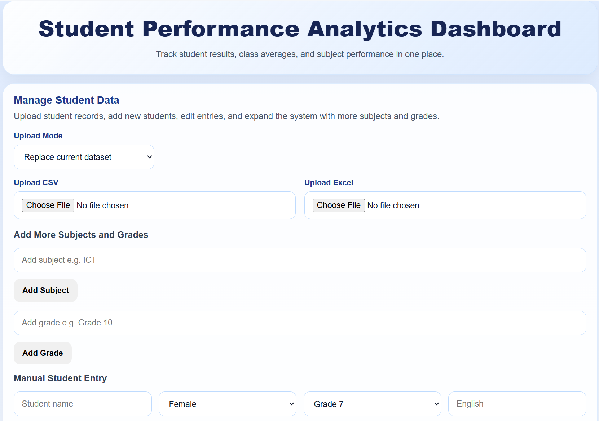
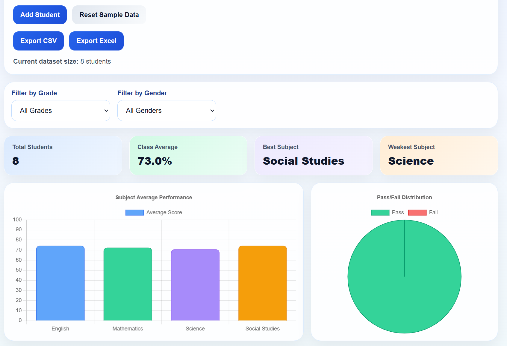
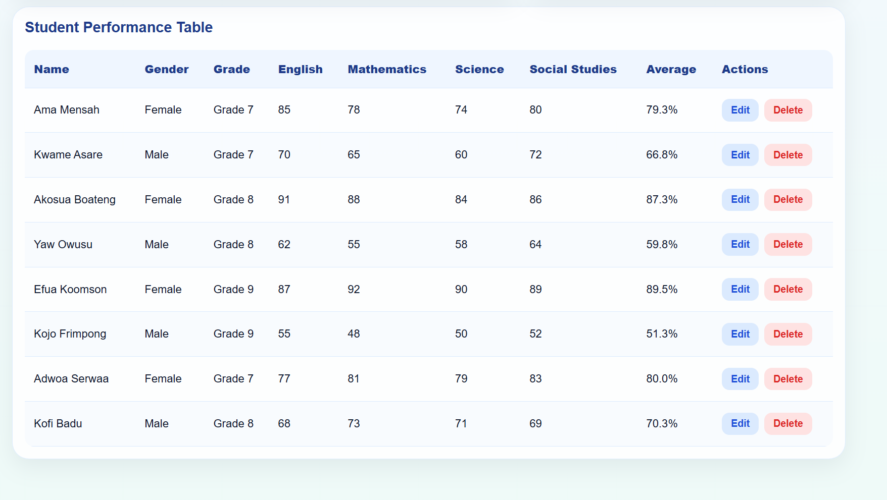

# Student Performance Analytics Dashboard

A modern student performance analytics dashboard built with React for managing and analyzing student results.

## Live Demo

[View Live Project](https://student-performance-dashboard-three.vercel.app/)

## Screenshots





## Features

- Grade-based student performance tracking
- Dynamic subjects and grades
- CSV and Excel upload
- Manual student entry
- Filtering by grade and gender
- Charts for performance insights
- Export to CSV and Excel
- Responsive interface

## Tech Stack

- React
- Vite
- Chart.js
- Papa Parse
- XLSX
- CSS

## Run Locally

```bash
npm install
npm run dev
```
