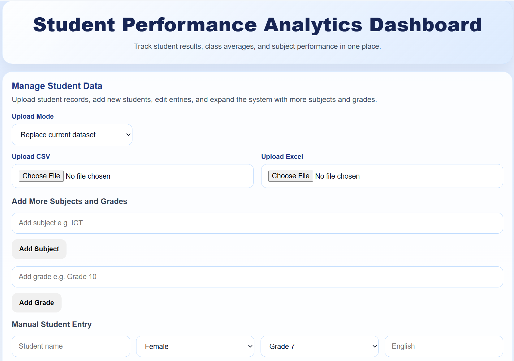
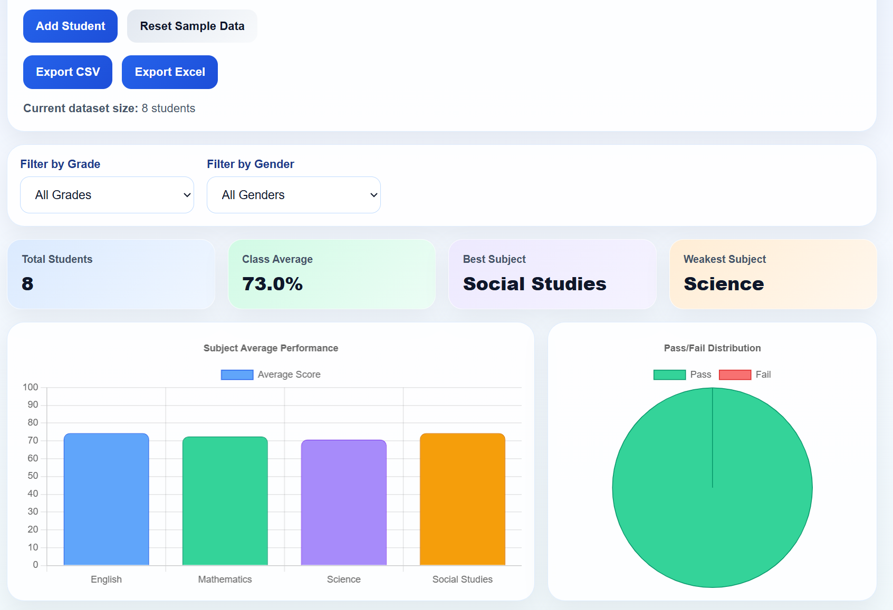
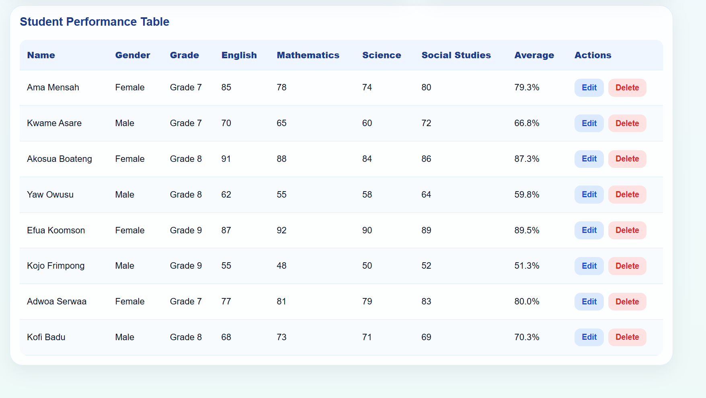

# Student Performance Analytics Dashboard

A portfolio-ready analytics dashboard for tracking student results, surfacing academic risk, and comparing performance across school terms.

## Live Demo

[View Live Project](https://student-performance-dashboard-three.vercel.app/)

## Why This Project Stands Out

This project goes beyond a static chart demo. It supports a realistic school workflow:

- upload CSV and Excel datasets
- manage subjects, grades, and terms dynamically
- review student records in a searchable performance table
- explore class insights and term-over-term trends
- export cleaned data back to CSV or Excel
- persist changes in the browser with `localStorage`

## Portfolio Highlights

- Built with React and Vite using reusable dashboard components
- Includes import, validation, filtering, analytics, export, and modal detail flows
- Tracks multiple academic terms so recruiters can see trend analysis, not just one-off charts
- Ships with sample data and a downloadable CSV template for quick evaluation
- Includes a lightweight test script for analytics utilities

## Screenshots





## Core Features

- Search by student name
- Filter by grade, gender, risk level, subject, and term
- Subject average bar chart
- Pass/fail distribution chart
- Term performance trend chart
- Insight cards for best subject, weakest subject, best grade, weakest grade, and student improvement
- Manual student entry and editing
- CSV and Excel upload support
- CSV template download
- CSV and Excel export
- Accessible student details modal with keyboard close support

## Tech Stack

- React 19
- Vite
- Chart.js
- react-chartjs-2
- Papa Parse
- XLSX
- ESLint

## Project Structure

```text
src/
  components/      UI sections for filters, charts, tables, modal, and data management
  data/            Sample dataset and display configuration
  utils/           Analytics, filtering, import/export helpers, and tests
```

## Local Development

```bash
npm install
npm run dev
```

## Quality Checks

```bash
npm run lint
npm run test
npm run build
```

## Sample Data Format

Your CSV or Excel file should include:

- `name`
- `gender`
- `grade`
- `term`
- one column for each subject, such as `English`, `Mathematics`, `Science`, and `Social Studies`

## Product Thinking Behind It

This dashboard is designed as if it were being handed to a school administrator:

- sample data loads instantly for demo purposes
- user changes persist across refreshes
- uploads can replace the current dataset or append to it
- exports make it easy to move processed data back into spreadsheets
- trend analysis helps identify improvement or decline over time

## Next Improvements

- role-based access with teacher/admin views
- PDF reporting for class summaries
- cloud sync with Firebase or Supabase
- richer testing around upload and filtering flows
