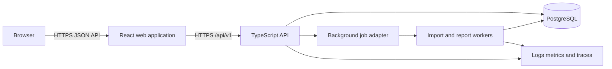
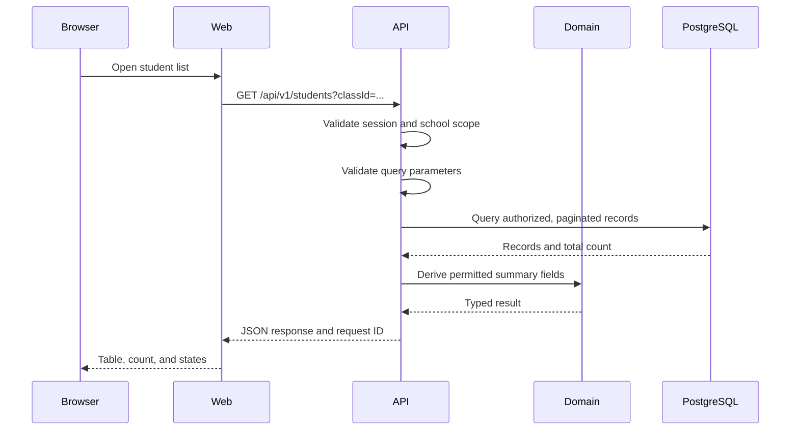
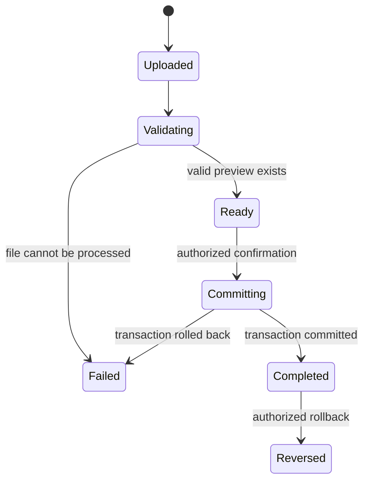

# Target architecture

## Architectural style

The application will use a modular monolith. The frontend, API, and database have explicit boundaries, but the backend remains one deployable service until measured scale or team ownership requires separation.



The first milestone implements the browser, web application, API, and PostgreSQL path. The job adapter is introduced when imports move to server-side processing.

## Repository direction

The current root remains a working Vite application during the first migration. The intended structure is:

```text
apps/
  web/                 React and Vite application
  api/                 TypeScript HTTP API
packages/
  contracts/           API schemas and generated or inferred types
  domain/              Pure grading and risk rules
  database/            Schema, migrations, repositories, and seeds
docs/
  adr/                  Architecture decision records
  architecture.md
  domain-model.md
  product-scope.md
```

The move into `apps/web` should occur only after the API read path works or in one isolated mechanical change. Mixing that move with feature changes would make review and rollback harder.

## Frontend responsibilities

The web application is responsible for:

- rendering role-appropriate routes and controls;
- collecting input and giving immediate feedback;
- requesting data through the documented API;
- presenting loading, empty, stale, offline, unauthorized, and error states;
- keeping transient interface state separate from server state;
- supplying accessible tables for chart data;
- preventing accidental loss of unsaved form work.

The frontend is not an authorization boundary. It must not calculate an official published result independently of the server.

## API responsibilities

The API is responsible for:

- authentication and session validation;
- tenant and role authorization;
- runtime request and response validation;
- orchestration of domain operations;
- transaction boundaries;
- persistence and audit events;
- pagination, sorting, and filtering;
- idempotency for imports and other retryable mutations;
- stable error codes safe for clients;
- structured operational telemetry.

Routes are versioned under `/api/v1`.

## Domain layer responsibilities

Pure domain modules implement:

- grade calculation;
- grading-policy validation;
- score-state rules;
- publication rules;
- explainable risk rules;
- import normalization decisions that do not require infrastructure.

Domain modules do not import React, HTTP framework objects, or database clients. This permits fast unit tests and makes official calculations reusable by API jobs.

## Database responsibilities

PostgreSQL enforces:

- foreign-key relationships;
- uniqueness within a school;
- valid state constraints that can be expressed safely in the schema;
- transaction consistency;
- migration history.

The application still validates input before executing a query. Database constraints form a final integrity boundary rather than the only validation layer.

## Request path



## Authentication and authorization boundary

The browser receives an opaque session cookie with `HttpOnly`, `Secure`, and an appropriate `SameSite` policy. The database stores only a hash of the session token.

Every protected API operation performs these checks:

1. Validate the session.
2. Resolve the user's active membership for the requested school.
3. Check the required role or teaching assignment.
4. Scope every query and mutation by `school_id`.
5. Record an audit event for sensitive actions.

Object identifiers alone never grant access. Tests must create records in two schools and prove cross-school reads and writes fail.

## API response conventions

Successful collection responses use a consistent envelope:

```json
{
  "data": [],
  "page": {
    "limit": 25,
    "nextCursor": null
  }
}
```

Errors use stable application codes:

```json
{
  "error": {
    "code": "ASSESSMENT_NOT_FOUND",
    "message": "The requested assessment was not found.",
    "requestId": "req_...",
    "fields": []
  }
}
```

Stack traces, SQL details, internal paths, and secrets are never returned to clients.

## Data fetching and consistency

- List endpoints use cursor pagination when stable ordering is available.
- Mutations return the committed representation.
- Mutable records carry a version used for optimistic concurrency.
- A stale update returns a conflict response rather than overwriting newer data.
- Official aggregate calculations run on the server from persisted inputs.
- Cache invalidation is added only after measurements identify a useful cache boundary.

## Import workflow



An upload never writes student or score records during preview. Commit uses a transaction and an idempotency mechanism. Invalid and missing numeric values are not converted to zero.

## Security controls

The implementation must include:

- runtime validation at every external boundary;
- parameterized database access;
- password hashing with a memory-hard algorithm;
- login and sensitive-endpoint rate limits;
- CSRF protection where the cookie and request design requires it;
- restrictive CORS and security headers;
- upload size and format restrictions;
- spreadsheet formula-injection protection on export;
- secret separation between environments;
- structured logs that exclude student names, scores, file bodies, credentials, and session tokens;
- dependency, secret, and static analysis in CI.

A repository-specific threat model will be written before authentication and file upload are exposed publicly.

## Accessibility boundary

- Each chart has a table or equivalent text representation.
- Forms have visible labels and associated errors.
- Dialogs manage focus and support keyboard dismissal.
- Async mutations announce progress and results.
- CI runs automated accessibility smoke tests.
- Critical workflows receive documented manual keyboard and screen-reader checks.

## Observability

The API emits structured events containing:

- timestamp;
- severity;
- service and release version;
- request or job ID;
- school ID when safe and useful;
- operation name;
- duration;
- result or safe error code.

Metrics begin with request rate, error rate, latency, database connection health, and job status. Alerts should correspond to user-visible failures.

## Deployment environments

- **Local:** local PostgreSQL, synthetic seed data, and developer tooling.
- **Preview:** isolated synthetic data for a pull request.
- **Staging:** production-like configuration with synthetic test accounts.
- **Production demo:** public portfolio deployment containing synthetic data only.

Environment variables are validated at startup. A missing required value stops the service with a safe, specific message.

## Testing boundaries

- Domain rules receive unit and property-based tests.
- Database repositories and API routes receive integration tests against PostgreSQL.
- Authorization tests cover roles, assignments, and two-school isolation.
- Browser tests cover the complete administrator-to-teacher-to-student workflow.
- Accessibility tests cover core routes and interactive components.
- Load tests use documented synthetic datasets and target budgets.

## First implementation slice

The initial end-to-end read slice is deliberately unauthenticated only in the local development environment or scoped to a seeded demo tenant behind a temporary adapter. It will:

1. Create the initial database tables and seed synthetic records.
2. Expose `GET /api/v1/students` with pagination and runtime validation.
3. Fetch the list from the React application.
4. Render loading, empty, and safe error states.
5. Test the route against a real test database.

No public deployment should expose this temporary path before session-based authorization is implemented.

