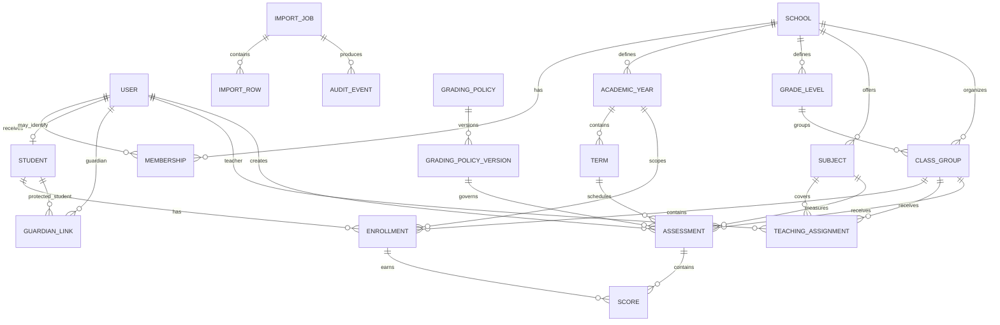

# Academic domain model

## Modelling principles

- Every persisted entity uses a stable opaque identifier.
- A student's identity is independent of a class, grade, term, or score.
- Tenant-owned records carry a `school_id` and are queried within that scope.
- Academic history is appended or superseded. Published history is not silently overwritten.
- Missing, excused, incomplete, and numeric-zero scores are different states.
- Calculated results retain the grading-policy version that produced them.
- Timestamps are stored in UTC. School-local dates retain the school's configured time zone for interpretation.

## Relationship overview

## Identity and tenancy

### School

Represents one tenant.

Core fields:

- `id`
- `name`
- `slug`
- `time_zone`
- `status`
- `created_at`
- `updated_at`

The public demo starts with one synthetic school, but the schema and authorization rules must not assume a single tenant.

### User

Represents an authenticated identity.

Core fields:

- `id`
- `email`
- `display_name`
- `password_hash`
- `email_verified_at`
- `status`
- `created_at`
- `updated_at`

Email uniqueness is system-wide for the first release. Credentials are not stored on student profiles.

### Membership

Connects a user to a school and grants one role.

Core fields:

- `id`
- `school_id`
- `user_id`
- `role`: `administrator`, `teacher`, `student`, or `guardian`
- `status`
- `created_at`
- `revoked_at`

A unique constraint prevents duplicate active membership for the same user, school, and role.

### Session

Stores a server-managed login session.

Core fields:

- `id`
- `user_id`
- `token_hash`
- `expires_at`
- `last_seen_at`
- `revoked_at`
- safe device and network metadata where justified

Only a hash of the opaque session token is stored.

## Academic structure

### Academic year

Core fields:

- `id`
- `school_id`
- `name`
- `starts_on`
- `ends_on`
- `status`

Date ranges for academic years within a school should not overlap unless the product later establishes a valid use case.

### Term

Core fields:

- `id`
- `school_id`
- `academic_year_id`
- `name`
- `sequence`
- `starts_on`
- `ends_on`
- `status`: `planned`, `open`, `locked`, or `archived`

The sequence controls display and trend order. Names such as "Term 1" are labels, not identifiers.

### Grade level

Core fields:

- `id`
- `school_id`
- `name`
- `sequence`
- `status`

### Class group

Represents a roster such as Grade 7A during an academic year.

Core fields:

- `id`
- `school_id`
- `academic_year_id`
- `grade_level_id`
- `name`
- `status`

### Subject

Core fields:

- `id`
- `school_id`
- `code`
- `name`
- `status`

Subject names are display data. Imports map external columns to stable subject IDs.

## People and assignments

### Student

Represents a learner independently of authentication.

Core fields:

- `id`
- `school_id`
- `student_number`
- `first_name`
- `last_name`
- `preferred_name`
- `status`
- `user_id`, nullable
- `created_at`
- `updated_at`

`student_number` is unique within a school. Names are not used to deduplicate students. Sensitive demographic fields should only be added for a defined use and authorization policy.

### Enrollment

Connects a student to a class for an academic year.

Core fields:

- `id`
- `school_id`
- `student_id`
- `class_group_id`
- `academic_year_id`
- `starts_on`
- `ends_on`, nullable
- `status`: `active`, `transferred`, `withdrawn`, `completed`

Historical enrollments remain available after a transfer.

### Guardian link

Connects a guardian user to a student.

Core fields:

- `id`
- `school_id`
- `guardian_user_id`
- `student_id`
- `relationship_label`
- `status`
- `verified_at`

This relationship alone does not grant administrator or teacher permissions.

### Teaching assignment

Authorizes a teacher to work with a subject and class during an academic year.

Core fields:

- `id`
- `school_id`
- `teacher_user_id`
- `class_group_id`
- `subject_id`
- `academic_year_id`
- `starts_on`
- `ends_on`, nullable

API authorization checks this assignment before allowing assessment or score mutations.

## Assessment and grading

### Assessment category

Examples include quiz, assignment, project, midterm, and final examination.

Core fields:

- `id`
- `school_id`
- `name`
- `code`
- `status`

### Assessment

Core fields:

- `id`
- `school_id`
- `term_id`
- `class_group_id`
- `subject_id`
- `category_id`
- `grading_policy_version_id`
- `created_by_user_id`
- `title`
- `assessed_on`
- `maximum_score`
- `weight`
- `status`: `draft`, `submitted`, `published`, `archived`
- `version`
- `published_at`, nullable
- `created_at`
- `updated_at`

`maximum_score` must be greater than zero. `version` supports optimistic concurrency.

### Score

Core fields:

- `id`
- `school_id`
- `assessment_id`
- `enrollment_id`
- `status`: `scored`, `missing`, `excused`, or `incomplete`
- `points`, nullable
- `feedback`, nullable
- `version`
- `created_by_user_id`
- `updated_by_user_id`
- `created_at`
- `updated_at`

Rules:

- `points` is required only when status is `scored`.
- `points` is between zero and the assessment maximum.
- One current score exists per assessment and enrollment.
- An excused score is excluded according to the grading policy.
- A missing score follows the configured missing-work policy and is never silently stored as zero.

### Grading policy and version

`GradingPolicy` supplies a stable identity. `GradingPolicyVersion` stores immutable rules with an effective date.

A version contains:

- grade bands;
- pass threshold;
- category weights;
- missing-work handling;
- rounding method;
- minimum evidence rule;
- effective date;
- creator and reason for change.

Published results retain their version reference. Updating a policy creates a new version rather than mutating the old rules.

### Published result

Materialized published results may be introduced when publication workflows are implemented.

Core fields:

- `id`
- `school_id`
- `enrollment_id`
- `term_id`
- `subject_id`
- `grading_policy_version_id`
- `numeric_result`
- `grade_label`
- `calculation_snapshot`
- `published_at`
- `published_by_user_id`
- `superseded_at`, nullable

The calculation snapshot records assessment IDs, score versions, exclusions, weights, and rounding so a published result can be reproduced.

## Risk review and intervention

### Risk rule version

Defines a transparent condition such as a decline across three assessments or a missing-work count above a threshold.

### Risk flag

Core fields:

- `id`
- `school_id`
- `student_id`
- `term_id`
- `subject_id`, nullable
- `risk_rule_version_id`
- `evidence_snapshot`
- `status`: `open`, `acknowledged`, `dismissed`, or `resolved`
- review fields and timestamps

The evidence snapshot contains the values that triggered the rule. It must not contain a generated diagnosis.

### Intervention

Core fields:

- `id`
- `school_id`
- `student_id`
- `risk_flag_id`, nullable
- `owner_user_id`
- `title`
- `starts_on`
- `review_on`
- `status`
- `outcome`, nullable

## Imports and auditing

### Import job

Core fields:

- `id`
- `school_id`
- `created_by_user_id`
- `original_filename`
- `content_hash`
- `status`: `uploaded`, `validating`, `ready`, `committing`, `completed`, `failed`, or `reversed`
- `mapping`
- row counts
- timestamps

The content hash helps identify a repeated upload. It is not the only duplicate check.

### Import row

Stores a normalized preview, validation messages, proposed action, and committed record reference. Original row content must be retained only as long as the documented import-debugging purpose requires it.

### Audit event

Core fields:

- `id`
- `school_id`
- `actor_user_id`, nullable for system actions
- `action`
- `entity_type`
- `entity_id`
- safe before-and-after changes or references
- `reason`, when required
- `request_id`
- `occurred_at`

Ordinary application roles cannot update or delete audit events.

## Initial migration subset

The first implementation milestone does not create every table above. It begins with:

- `schools`
- `academic_years`
- `terms`
- `grade_levels`
- `class_groups`
- `subjects`
- `students`
- `enrollments`
- `assessments`
- `scores`

Seed data will convert the current flat sample records into stable students and term-specific academic records. Authentication tables follow in the next milestone.

